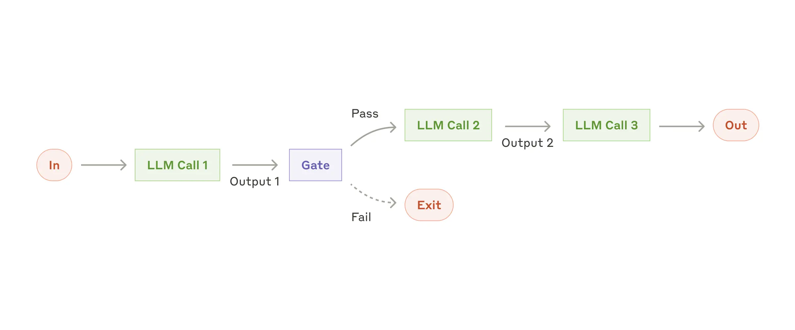

> 原文链接：https://www-anthropic-com/engineering/building-effective-agents
> 
> 

# ▍Agent和workflow是什么，什么情况下使用二者？

### ▍Workflow（工作流）——程序员主导

> *"Workflows are systems where LLMs and tools are orchestrated through predefined code paths-"*
> （工作流是通过预定义代码路径来编排 LLM 和工具的系统）
> 
> 

核心特征：

- 确定性：执行路径是硬编码的，if/else、循环、顺序都由开发者定义

- 可预测：每次输入 X，必然经过步骤 A→B→C，输出 Y

- 开发者掌控：LLM 只是流程中的"工人"，负责执行特定子任务，不参与流程决策


### ▍Agent（智能体）——模型主导

> *"Agents, on the other hand, are systems where LLMs dynamically direct their own processes and tool usage, maintaining control over how they accomplish tasks-"*
> （智能体是 LLM 动态指导自身流程和工具使用的系统，自己掌控完成任务的方式）
> 
> 

核心特征：

- 自主性：LLM 自己决定下一步做什么、用什么工具、何时停止

- 动态决策：没有预定义路径，根据任务进展实时调整策略

- 开放式：可以决定迭代多少次、是否需要向用户求助、如何组合工具

- 不可预测：同样的输入，执行路径可能完全不同


# ▍为什么要区分 Agent 和 workflow？


按照 Anthropic 的指导概念，也许市面上大多 “agent” 其实是 “workflow”？

**核心建议**：

1. 先简单后复杂：先用单个 LLM 模块，不够再用 Workflow，最后才考虑 Agent

2. Workflow 优先：对于定义明确的任务，Workflow 提供可预测性和一致性

3. Agent 是最后手段：只有当任务复杂度极高、无法预定义步骤时，才使用 Agent 架构

**典型 Agent 使用场景**：

- SWE-bench Coding Agent：根据任务描述自主决定修改哪些文件、如何修改

- Computer Use：Claude 自主使用计算机完成任务，自己决定点击哪里、输入什么


> Examples where agents are useful:
> 
> The following examples are from our own implementations:
> 
> - A coding Agent to resolve [SWE-bench tasks](https://www.anthropic.com/research/swe-bench-sonnet), which involve edits to many files based on a task description;
> 
> - Our [“computer use” reference implementation](https://github.com/anthropics/anthropic-quickstarts/tree/main/computer-use-demo), where Claude uses a computer to accomplish tasks-
> 
> 


**决策树**

```text
开始
  ↓
任务能否用单次 LLM 调用 + 上下文解决？
  ↓ 是 → 不要建 Agent 系统
  ↓ 否
任务步骤是否明确且可预定义？
  ↓ 是 → 使用 Workflow（选择 5 种模式之一）
  ↓ 否
是否需要高度灵活性和模型自主决策？
  ↓ 是 → 使用 Agent（但做好监控和成本管控）
  ↓ 否 → 重新思考任务定义
```


> *\[**https://towardsdatascience-com/a-developers-guide-to-building-scalable-ai-workflows-vs-agents/**\]\("Workflows are more like you calling the shots and the LLM following your lead- Agents are more like hiring a brilliant, slightly chaotic intern who figures things out on their own — sometimes beautifully, sometimes in terrifyingly expensive ways-"\)*
> 
> \(工作流更像是LLM跟随你的指令。代理更像是雇佣一个聪明但有点混乱的实习生，他自己想办法——有时干的非常完美，有时的方式贵的可怕。\)
> 
> 


# ▍怎么构建调用模块、workflow和agents（Building blocks, workflows, and agents）


正如前文所言，模块  --\> workflow --\> agent，并且这个演进过程中的复杂度是递增的。


## ▍构建增强型LLM模块


作为智能体中基础单元级别的东西，我们构建它可以是一个通过 `检索` 、`工具`、`记忆`等手段增强LLM调用过程，模型会主动地去使用这些功能并且自行决定保留哪些东西，最终达到提升模型输出准确度的效果


## ▍Workflow模式 1 ：Prompt chaning 模式




### ▍核心概念

Prompt Chaining 是将复杂任务分解为**一系列顺序执行的步骤**，每个步骤由独立的 LLM 调用完成，前一步的输出作为后一步的输入。整个流程可以通过"**门控（Gate）**"机制进行质量检查，确保中间产物符合预期后才进入下一环节。


这是一种**线性流水线**架构，强调**分而治之**和**质量控制**。


### ▍适用场景

- 任务天然具有**明确的阶段性**（如：构思→起草→修改→润色）

- 每个子任务**独立且清晰**，可以单独优化提示词

- 对**输出质量要求高**，**愿意用延迟换取准确性**

- 需要**中途验证点**，避免错误在后续步骤放大

    

### ▍优点

|优势|说明|
|---|---|
|**质量可控**|每个环节可单独优化和检查，错误不会累积|
|**调试友好**|流程透明，哪个环节出问题一目了然|
|**渐进式优化**|可以针对特定步骤改进，不影响整体|
|**灵活性**|可以在任意步骤插入人工审核或条件分支|


### ▍缺点

|劣势|说明|
|---|---|
|**延迟累积**|必须等前一步完成才能开始下一步|
|**成本叠加**|多次 LLM 调用，Token 消耗累加|
|**流程僵化**|路径固定，无法根据中间结果动态调整策略|
|**上下文截断**|长链条可能导致前期信息在后续步骤丢失|


### ▍关键注意事项

1. **门控设计要精准**：Gate 的通过/失败标准必须明确，避免主观判断导致流程卡死或放行错误内容

2. **信息传递保真**：确保前一步的输出格式适合下一步的输入要求，必要时添加格式转换步骤

3. **错误处理机制**：明确 Gate 失败后的处理路径（重试、终止、降级输出等）

4. **链条长度控制**：避免过长链条，考虑将多个步骤合并或改用其他模式

    

### ▍应用示例

**多语言营销内容生成**


某跨境电商需要为新品发布创建多语言营销材料：


1. **步骤一：生成核心卖点**（LLM Call 1）

    - 输入：产品技术规格、目标市场、品牌调性

    - 输出：3-5条核心卖点（英文）

    - **Gate 检查**：卖点是否突出差异化？是否符合品牌调性？

        

2. **步骤二：撰写营销文案**（LLM Call 2）

    - 输入：通过检查的核心卖点

    - 输出：英文营销长文案（500词）

    - **Gate 检查**：文案是否吸引人？是否有语法错误？

        

3. **步骤三：本地化翻译**（LLM Call 3）

    - 输入：通过的英文文案

    - 输出：日文版文案（适应日本市场文化）

    - **Gate 检查**：翻译是否自然？文化适配是否到位？

        

4. **步骤四：格式标准化**（LLM Call 4）

    - 输入：通过的日文文案

    - 输出：带HTML标签的终稿（可直接上传电商平台）

        

**为什么不用单次调用？** 因为每个环节都需要专门优化（卖点提炼需要商业思维，翻译需要文化理解，格式化需要技术规范），且必须在每个环节确认质量，避免最后才发现问题需要全部重做。


---


## ▍Workflow模式 2 ：Routing（路由）


### ▍核心概念

Routing 是构建一个**智能分类器**，根据输入的特征将其分配到**专门化的处理分支**。每个分支针对特定场景优化，实现"专人专事"的效果。


这是一种**分支结构**架构，核心是**分类准确性**和**专业化处理**。


### ▍适用场景

- 输入可以明确分为**几类互斥的场景**

- 不同类别需要**完全不同的处理方式、工具或提示词**

- 使用**统一处理会相互干扰**（优化A类会降低B类效果）

- 需要**差异化资源分配**（如不同模型、不同成本预算）

    

### ▍优点

|优势|说明|
|---|---|
|**专业化优化**|每个分支可针对特定场景深度优化，效果优于通用方案|
|**资源优化**|简单任务用轻量模型，复杂任务用强力模型，平衡成本与效果|
|**隔离性**|各类错误不影响其他分支，问题定位更清晰|
|**可扩展**|新增类别只需添加新分支，不影响现有逻辑|


### ▍缺点

|劣势|说明|
|---|---|
|**分类瓶颈**|如果分类器出错，后续全部错误，且难以发现|
|**边界模糊**|输入可能同时属于多类，或难以归类，需要兜底策略|
|**维护成本**|每个分支独立维护，类别增多时复杂度上升|
|**延迟不确定**|不同分支处理时间不同，整体延迟取决于被选中的分支|


### ▍关键注意事项

1. **分类器优先优化**：Router 的准确度是系统成败关键，应投入最多精力调优

2. **明确分类标准**：类别定义要**互斥且穷尽**，避免歧义和遗漏

3. **设置置信度阈值**：低置信度分类应触发人工审核或通用处理，而非强行分类

4. **监控分类分布**：长期观察各类别占比，发现数据漂移及时调整

    

### ▍应用示例

**智能客服路由系统**


某 SaaS 平台的客户咨询接入 LLM 处理：


1. **Router 分类器**分析用户输入：

    - **账单类**：包含"退款"、"发票"、"扣费"等关键词

    - **技术类**：包含"报错"、"无法连接"、"API"等关键词  

    - **使用类**：包含"怎么用"、"功能在哪里"、"教程"等关键词

        

2. **分支处理**：

    - **账单类** → 轻量模型（Haiku）\+ 连接财务系统查询订单状态

    - **技术类** → 强力模型（Sonnet）\+ 访问知识库和日志系统

    - **使用类** → 中等模型 \+ 检索帮助文档和截图指引

        

3. **特殊处理**：

    - 分类置信度\<0-8 → 转人工客服

    - 同时包含多类特征 → 询问用户澄清意图

        


---


## ▍Workflow模式 3 ：Parallelization（并行化）


### ▍核心概念

Parallelization 是**同时发起多个 LLM 调用**，处理同一任务的不同方面或同一问题的多次尝试，最后**程序化聚合结果**。包含两种变体：

- **Sectioning：**把任务拆解成多个子任务并行处理

- **Voting：**多次运行同样的任务以获取不同的输出，最终进行聚合输出。


这是一种**并行结构**架构，核心是**并发处理**和**结果聚合**。


### ▍适用场景

- 任务可以**分解为独立子任务**，无相互依赖

- 需要**多角度验证**以提高准确性，想象不同的裁判对同一个选手进行打分，最终根据所有分数按一定规则计算出最终结果（Voting）

- 需要**全面覆盖**不同维度，并且能够清晰的拆分成多个领域（Sectioning）

- **延迟要求高**，不能接受串行处理的累积延迟

    

### ▍优点

|优势|说明|
|---|---|
|**速度优势**|并行执行，总延迟取决于最慢的分支|
|**质量提升**|volting 机制可以提高模型输出的置信度|
|**容错性**|单个分支失败不影响其他分支，可部分降级|
|**可扩展性**|增加并行度只需更多算力，无需重构逻辑|


### ▍缺点

|劣势|说明|
|---|---|
|**成本激增**|同时调用多次，Token 消耗和 API 费用成倍增加|
|**聚合复杂性**|如何合并多个输出需要精心设计，可能引入新误差|
|**结果冲突**|不同分支可能给出矛盾结论，需要仲裁逻辑|
|**资源竞争**|高并发可能触发速率限制，需要队列管理|


### ▍关键注意事项

1. **真正的独立性**：确保子任务之间无依赖，否则并行无意义甚至出错

2. **聚合策略明确**：预先定义如何合并结果（并集/交集/加权/多数决等）

3. **去重机制**：Voting 模式下，避免模型生成雷同内容，可通过温度参数或提示词差异实现多样性

4. **资源预算控制**：设置并行上限，避免突发流量导致成本失控

    

### ▍应用示例

**代码安全审查（Voting 模式）**


某金融科技公司在代码提交前进行自动化安全审查：


1. **并行启动三个审查员**：

    - **审查员 A**：专注**注入攻击**（SQL、NoSQL、命令注入）

    - **审查员 B**：专注**身份认证**（会话管理、权限绕过、JWT问题）

    - **审查员 C**：专注**敏感数据**（日志泄露、硬编码密钥、不安全传输）

        

2. **每个审查员独立分析**同一段代码，输出发现的问题列表（包含位置、严重程度、修复建议）

    

3. **聚合器合并结果**：

    - **并集**：汇总所有独特问题（避免单点遗漏）

    - **严重度加权**：两个以上审查员都发现的问题标记为高危

    - **去重**：同一漏洞被多人发现时合并描述，保留最详细的修复建议

        

4. **输出**：结构化报告，按严重度排序，附带修复代码示例

    

安全漏洞类型多样，单个审查员（即使是强力模型）可能遗漏特定类型问题。并行专家各司其职，既保证覆盖面，又通过交叉验证提高可信度。相比串行审查，延迟从3次调用累加变为单次调用时间（实际略长），效率大幅提升。


---


## ▍Workflow模式 4 ：Orchestrator-Workers（协调器-工作者）


### ▍核心概念

Orchestrator-Workers 引入一个**中央协调器（Orchestrator）**，它接收复杂任务后，**动态分析需求并拆解为子任务**，分配给多个**工作者（Workers）** 并行处理，最后整合结果。与 Parallelization 的关键区别：**子任务不是预先定义的，而是由协调器根据输入实时生成的**。


这是一种**动态分布式**架构，核心是**自适应规划**和**任务分解**。


### ▍适用场景

- 任务**复杂度差异大**，无法预先定义固定步骤

- 输入**结构多变**，需要"先理解再行动"

- 需要**多源信息整合**（如从多个独立数据源收集信息）

- 问题边界**开放**，需要探索性处理

    

### ▍优点

|优势|说明|
|---|---|
|**灵活性**|根据输入动态调整策略，适应不同复杂度|
|**可扩展**|增加工作者类型即可扩展能力，无需修改核心逻辑|
|**模块化**|工作者之间相互独立，可单独开发、测试、优化|
|**效率优化**|只调用必要的工作者，避免无效计算|


### ▍缺点

|劣势|说明|
|---|---|
|**单点依赖**|协调器是瓶颈，如果分解策略错误，全盘皆输|
|**调试困难**|动态生成的流程难以追踪和复现问题|
|**延迟较高**|需要等待协调器分析 \+ 工作者执行 \+ 结果整合|
|**上下文管理**|协调器需要掌握全局信息，长上下文可能影响效果|


### ▍关键注意事项

1. **协调器能力要求高**：需要强大的规划和推理能力，通常使用最强模型

2. **工作者接口标准化**：所有工作者输入输出格式必须统一，便于协调器调用和结果整合

3. **任务粒度控制**：避免分解过细（增加开销）或过粗（失去灵活性）

4. **失败重试机制**：单个工作者失败时，协调器应能重新分配或调整策略

5. **防止循环依赖**：确保任务分解后无循环依赖，形成可执行的 DAG（有向无环图）

    

### ▍应用示例

**智能编程助手（复杂代码修改）**


某开发团队使用 AI 助手处理 GitHub Issue：


1. **用户输入**："修复用户登录模块的内存泄漏问题，同时确保不影响现有会话管理"

    

2. **Orchestrator 分析**：

    - 读取 Issue 描述和代码库结构

    - 决定需要：

        - **Worker A**：搜索相关文件（定位登录模块代码）

        - **Worker B**：分析内存使用模式（找出泄漏点）

        - **Worker C**：检查会话管理逻辑（评估修改影响）

        - **Worker D**：生成修复代码

            

3. **动态任务分配**：

    - Worker A 返回：`auth/login.py`、`session/manager.py` 等5个相关文件

    - Worker B 分析后发现：`database connection` 未在异常时关闭

    - Worker C 确认：修改此处不会影响会话持久化

    - Worker D 基于以上信息生成修复补丁

        

4. **Orchestrator 整合**：

    - 合并各工作者输出为完整解决方案

    - 生成变更摘要（改了哪些文件、为什么、如何测试）

        

5. **输出**：包含代码补丁、测试用例、回滚方案的完整报告

    

**为什么不用固定流程？** 不同 Issue 涉及的文件数量、问题类型、影响范围差异巨大。有的只需改1个文件，有的需要跨10个模块协调。固定流程要么过度设计（简单问题也走全套），要么能力不足（复杂问题无法处理）。Orchestrator 像项目经理，按需组建临时团队。


---


## ▍Workflow模式 5 ：Evaluator-Optimizer（评估器-优化器）


### ▍核心概念

Evaluator-Optimizer 构建一个**迭代优化闭环**：生成器（Generator）产出内容，评估器（Evaluator）检查质量并提供反馈，生成器根据反馈改进，循环直到满足质量标准或达到迭代上限。这是一种**对抗式协作**架构，核心是**质量控制**和**渐进改进**。


### ▍适用场景

- 对**输出质量要求极高**，不能接受"一次性"结果

- 有**明确可验证的质量标准**（如准确性、风格、格式等）

- 任务具有**渐进可改进性**（每次迭代都能变得更好）

- **延迟和成本可接受**，优先考虑质量

    

### ▍优点

|优势|说明|
|---|---|
|**质量上限高**|通过迭代逼近最优解，单次调用难以达到同等质量|
|**自纠正能力**|能发现并修复生成过程中的错误和疏漏|
|**适应性强**|评估标准可动态调整，适应不同质量要求|
|**透明度**|迭代历史记录了改进过程，便于理解和审计|


### ▍缺点

|劣势|说明|
|---|---|
|**成本不可控**|每次迭代都消耗 Token，复杂任务可能循环多次|
|**延迟极高**|必须等待多次生成-评估周期，实时性最差|
|**终止条件难设**|如何定义"足够好"？容易陷入**无限优化或过早停止**|
|**反馈质量依赖**|如果评估器反馈模糊，优化效果有限|


### ▍关键注意事项

1. **评估器必须具体**：反馈应包含"哪里不好"和"怎么改"，避免笼统评价

2. **设置硬性上限**：最大迭代次数和预算上限，防止无限循环

3. **收敛检测**：如果连续多次迭代无显著改进，提前终止

4. **角色隔离**：生成器和评估器应使用不同提示词，避免"自我陶醉"

5. **人工兜底**：复杂情况应允许评估器建议"需要人工审核"并退出循环

    

### ▍应用示例

**法律文书起草（高准确性要求）**


某律所使用 AI 辅助起草合同条款：


1. **初始生成**（Generator）：

    - 输入：客户需求（"起草一份软件开发合同，保护知识产权"）

    - 输出：初版合同草案（包含标准条款）

        

2. **法律评估**（Evaluator）：

    - 检查维度：

        - **合规性**：是否符合《合同法》和《知识产权法》？

        - **完整性**：是否包含交付标准、验收流程、违约责任？

        - **保护性**：知识产权归属条款是否足够保护委托方？

        - **风险点**：是否有对律所不利的模糊表述？

    - 输出评估报告："知识产权条款第3-2条不够明确，建议细化所有权转移时点；缺少数据安全相关条款"

        

3. **优化生成**（Generator）：

    - 基于反馈修改合同，细化条款

        

4. **二次评估**（Evaluator）：

    - 输出："整体合规，但建议增加不可抗力条款的详细定义"

        

5. **三次优化**（Generator）：

    - 补充不可抗力条款

        

6. **最终评估**（Evaluator）：

    - 输出："符合质量标准，建议输出"

        

**迭代价值**：法律文书对准确性要求极高，单次生成几乎必然存在疏漏。通过专业评估器（模拟资深律师审查）的多轮检查，逐步消除风险点，最终输出达到可直接提交客户审核的质量。虽然耗时较长（3-5轮迭代），但相比人工起草\+审查仍节省大量时间。


---


## ▍五种 Workflow 模式对比与选择建议


|维度|Prompt Chaining|Routing|Parallelization|Orchestrator-Workers|Evaluator-Optimizer|
|---|---|---|---|---|---|
|**核心哲学**|分步求精|专人专事|多管齐下|按需组队|精雕细琢|
|**控制方式**|硬编码顺序|硬编码分支|硬编码并行|动态生成任务|动态循环迭代|
|**灵活性**|低|中|低|高|高|
|**延迟**|中（累加）|低|低（并行）|高（动态规划）|很高（迭代）|
|**成本**|中（累加）|可控|高（并行倍率）|中-高（按需）|高（不可预估）|
|**质量上限**|中|中-高|高|高|极高|
|**调试难度**|低|中|中|高|高|
|**最适合**|流程明确的任务|多类别输入|需多角度验证|开放复杂问题|质量优先场景|


### ▍选择决策树

```text
1. 任务能否一次性完成？
   └─ 是 → 直接调用 LLM，无需工作流
   
2. 任务是否属于不同类别需不同处理？
   └─ 是 → Routing
   
3. 任务是否需要多维度审查/生成？
   └─ 是 → Parallelization
   
4. 任务步骤是否明确且固定？
   └─ 是 → Prompt Chaining
   
5. 任务是否无法预先定义步骤？
   └─ 是 → Orchestrator-Workers
   
6. 是否愿意为质量接受迭代成本？
   └─ 是 → Evaluator-Optimizer
   └─ 否 → 重新思考任务定义或降级需求
```


这五种模式并非互斥，实际系统中常常**组合使用**。例如：

- **Routing \+ Prompt Chaining**：先分流，再在每个分支内使用流水线

- **Orchestrator \+ Parallelization**：协调器分配任务，多个工作者并行处理

- **Prompt Chaining \+ Evaluator-Optimizer**：流水线的最后一步加入质量迭代


关键在于理解每种模式的**设计哲学**和**适用边界**，避免为了"高级"而"高级"，选择最适合业务场景的简单方案。


## ▍构建 Agent


## ▍Agent 核心概念与架构

### ▍核心概念


Agent 是随着 LLM 关键能力成熟（理解复杂输入、推理规划、可靠使用工具、错误恢复）而在生产环境中兴起的新型架构。与 Workflows 的**预定义路径**不同，Agents 的核心特征是**动态自主决策**：


- **启动方式**：接收人类用户的明确指令或通过交互式讨论明确任务目标

- **执行特征**：一旦任务清晰，Agent **独立规划和运行**，无需人类逐步指导

- **交互机制**：可在关键节点或遇到障碍时**暂停并请求人类反馈**

- **环境感知**：每一步都从环境中获取"事实（ground truth）"（如工具调用结果、代码执行输出）来评估进展

- **终止条件**：任务完成时自然结束，也可设置**硬性停止条件**（如最大迭代次数）保持控制

    

关键区别在于控制权的转移：Workflows 中开发者通过代码控制流程，而 Agents 中**LLM 掌握控制权**，自主决定下一步行动、工具使用和策略调整。


### ▍适用场景


- 任务**无法预先定义步骤**，需要探索性执行

- 环境**动态变化**，需要根据反馈实时调整策略

- 需要**多轮工具调用**且调用顺序不确定

- 问题边界**开放**，可能涉及未预见的子任务

- 可以接受**不确定性**以换取灵活性和适应性

    

### ▍优点


|优势|说明|
|---|---|
|**灵活适应**|能处理 Workflows 无法覆盖的开放性问题|
|**减少开发工作量**|无需穷尽所有分支和边界条件，Agent 自行处理|
|**可处理不确定性**|面对模糊输入时能主动澄清或试探|
|**持续优化能力**|根据执行反馈自我纠正，不依赖硬编码规则|


### ▍缺点


|劣势|说明|
|---|---|
|**不可预测性**|执行路径不透明，难以复现和调试|
|**成本风险**|可能陷入无限循环或过度探索，消耗大量 Token|
|**延迟不稳定**|完成时间差异巨大，难以承诺 SLA|
|**控制难度大**|可能偏离目标或产生意外行为，需要强力护栏|
|**错误放大**|早期错误判断可能导致后续一系列错误决策|


### ▍关键注意事项


1. **明确退出条件**：必须设置最大迭代次数、预算上限、时间限制等硬性停止条件

2. **保持人类介入通道**：在关键决策点和遇到障碍时必须能暂停并请求人类反馈

3. **环境反馈必须真实**：确保工具返回真实结果而非模拟数据，避免幻觉累积

4. **任务边界清晰**：启动时确保任务目标明确，避免范围蔓延

5. **日志与可观测性**：详细记录 Agent 的决策过程、工具调用历史和思考路径

    

### ▍应用示例


**自动化软件开发 Agent**


用户指令："帮我修复这个 Python 项目的内存泄漏问题，项目地址是 github-com/example/app"


1. **任务理解阶段**：

    - Agent 克隆代码仓库，阅读 README 和项目结构

    - 发现这是一个 Web 应用，使用 Flask 和 SQLAlchemy

    - 主动询问用户："发现多个服务模块，泄漏是在特定 API 还是整体性能下降？"

        

2. **自主执行阶段**（用户回复："主要出现在用户登录 API"）：

    - 规划：定位登录相关代码 → 分析数据库连接处理 → 查找未关闭的资源

    - 工具调用：使用代码搜索工具找到 `auth/login.py`

    - 代码阅读：发现 `get_db_connection()` 在异常时未调用 `close()`

    - 环境验证：编写测试脚本复现泄漏，确认问题

        

3. **遇到困难**：

    - 尝试修复时发现修改会影响会话管理模块

    - **暂停并询问**："修复需要修改 session 管理，是否继续？建议先备份当前配置"

        

4. **完成交付**：

    - 用户确认后，实施修复，运行测试验证

    - 提交代码变更并生成 PR 描述

    - 任务完成，报告总结修改内容和验证结果

        

---


## ▍Agent 设计原则


### ▍核心概念


Anthropic 总结了构建生产级 Agent 的四大设计原则，这些原则源于与数十个团队合作的经验教训，强调**透明性、智能体契约和工具设计**的重要性。


### ▍四大原则详解


#### ▍原则一：保持 Agent 能力的简单性


**理念**：Agent 系统并非总是必要，应该从简单方案开始，仅在真正需要灵活性时才引入 Agent。


**实践要点**：

- 先用单次 LLM 调用 \+ 上下文解决问题

- 不足时尝试 Workflows，最后才考虑 Agents

- Agent 的延迟和成本更高，需权衡投入产出比

    

#### ▍原则二：透明性——展示 Agent 的思考过程


**理念**：用户需要理解 Agent 正在做什么、计划做什么，建立信任并允许适时介入。


**实现方式**：

- 显式展示 Agent 的**思考步骤**和**规划过程**

- 记录并展示**工具调用序列**（何时、为何调用什么工具）

- 提供**系统日志**供用户审查决策路径

    

#### ▍原则三：智能体契约——精心设计的工具接口


**理念**：通过提示工程为 Agent 建立清晰的"契约"，明确工具能力边界和协作规则。


**契约内容**：

- 每个工具的**职责范围**和**使用场景**

- **成功标准**和**失败处理**方式

- Agent 的**自主权限边界**（何时必须询问人类）

- **工具调用格式**和**参数规范**

    

#### ▍原则四：工具设计即用户体验


**理念**：Agent 使用的工具直接影响最终输出质量，工具设计需要考虑模型能力和人类可读性。


**设计要点**：

- 工具名称和描述**面向模型优化**，清晰表达用途

- 工具返回结果**面向人类可读**，便于理解和调试

- 提供**示例用法**和**常见错误处理**

    

### ▍应用示例


**透明性设计：旅行规划 Agent 的界面**


不良设计：

```text
Agent 正在工作... [加载中]
[5分钟后]
为您规划了巴黎3日游行程。
```


良好设计（透明性原则）：

```text
🎯 任务理解：用户需要巴黎3日文化游，预算中等，偏好艺术博物馆

📋 执行计划：
1. 搜索巴黎主要艺术博物馆 ✓
2. 查询各博物馆开放时间和票价 ✓  
3. 根据地理位置规划路线 ⏳ 当前步骤
4. 推荐附近餐厅
5. 生成日程表

🔧 工具调用记录：
- search_museums(query="Paris art museums") → 返回12个结果
- get_opening_hours(museum_id="louvre") → 周二闭馆，注意调整
- calculate_route(locations=[...]) → 正在执行...

⏸️ 遇到决策点：周二卢浮宫闭馆，是否改为奥赛博物馆？ [是] [否] [让我决定]
```


---


## ▍Agent 工具设计深度指南


### ▍核心概念


工具是 Agent 与外部世界交互的**接口**，工具设计的质量直接决定 Agent 的能力上限。相比 Workflows 中开发者直接调用工具，Agent 需要**通过 LLM 自主选择和调用工具**，这对接口设计提出了更高要求。


### ▍工具设计目标


|目标|说明|
|---|---|
|**可发现性**|Agent 能快速理解何时使用该工具|
|**易用性**|参数清晰，错误率低|
|**可靠性**|返回结果一致，异常处理规范|
|**可组合性**|能与其他工具配合完成复杂任务|


### ▍关键设计原则


#### ▍1- 面向模型的文档


**原则**：假设工具使用者是 LLM 而非人类开发者。


**实践**：

- **命名清晰**：`search_weather(location: str)` 优于 `get_data(param1)`

- **描述具体**：说明工具做什么、返回什么格式、何时使用

- **提供示例**：在工具描述中包含调用示例

    

#### ▍2- 参数设计简洁


**原则**：减少 Agent 的认知负担，降低参数选择错误。


**实践**：

- **参数数量**：尽量少于 5 个，复杂场景拆分为多个工具

- **类型明确**：使用枚举而非自由文本（如 `style: ["formal", "casual"]`）

- **默认值合理**：为可选参数提供智能默认值

    

#### ▍3- 返回结果结构化


**原则**：Agent 需要解析结果以决定下一步，结构混乱会导致决策错误。


**实践**：

- **固定格式**：使用 JSON/XML 等结构化格式

- **包含元数据**：返回数据来源、时间戳、置信度等上下文

- **错误标准化**：统一错误码和错误信息格式

    

#### ▍4- 错误信息可行动


**原则**：Agent 遇到错误后需要知道如何修复。


**实践**：

- **区分错误类型**：参数错误、权限错误、资源不存在等

- **提供修复建议**："参数 `date` 格式应为 YYYY-MM-DD"

- **降级选项**：部分失败时返回可用数据而非完全失败

    

### ▍应用示例


**代码审查工具设计**


不良设计：

```python
def analyze_code(code): 
    # ▍返回自由文本描述
    return "这段代码看起来还行，但第10行有个变量名不太清晰，还有性能可以优化"
```


良好设计：

```python
def analyze_code(code: str, focus_areas: List[Literal["security", "performance", "readability", "correctness"]]) -> dict:
    """
    分析代码质量并返回结构化问题列表。
    
    使用场景：
    - 提交代码前自动检查
    - 代码审查时聚焦特定维度
    
    参数：
        code: 需要分析的源代码字符串
        focus_areas: 重点关注领域，可选 security/performance/readability/correctness
    
    返回：
        {
            "summary": "发现3个问题，1个高危",
            "issues": [
                {
                    "type": "security",
                    "severity": "high", 
                    "line": 15,
                    "message": "SQL查询使用字符串拼接，存在注入风险",
                    "suggestion": "使用参数化查询：cursor.execute('SELECT * FROM users WHERE id = ?', (user_id,))",
                    "confidence": 0.95
                }
            ],
            "metrics": {
                "complexity_score": 12,
                "test_coverage": 0.6
            }
        }
    """
```


**为什么更好？**

- Agent 知道何时调用（提交代码前）

- 知道如何解析结果（结构化 JSON）

- 知道严重程度（high/medium/low）

- 知道如何修复（有具体建议）

- 可以据此决定：高危问题必须修复，低危问题可记录后继续

    

---


## ▍Agent 自主循环：与环境交互的机制


### ▍核心概念


Agent 的核心能力是**自主循环（Autonomous Loop）**：感知环境 → 思考规划 → 执行行动 → 观察结果 → 评估进展 → 决定下一步。这个循环的质量决定 Agent 的可靠性和效率。


### ▍循环结构详解


```text
┌─────────────────────────────────────────┐
        ▼                                         │
   [感知环境] ← 接收用户指令、工具返回、系统状态      │
      │                                         │
      ▼                                         │
   [思考规划] ← 分析当前状态、设定子目标、选择策略    │
      │                                         │
      ▼                                         │
   [执行行动] ← 调用工具、生成代码、请求人类输入      │
      │                                         │
      ▼                                         │
   [观察结果] ← 解析工具返回、验证执行效果          │
      │                                         │
      ▼                                         │
   [评估进展] ← 对比目标、检查完成度、识别障碍      │
      │                                         │
      └────── [完成/继续/暂停/求助] ──────────────┘
```


### ▍关键组件


#### ▍1- 环境感知（Ground Truth）


**定义**：Agent 从外部世界获取的**客观事实**，而非模型内部知识。


**来源**：

- 工具调用结果（API 返回、数据库查询）

- 代码执行输出（运行结果、错误日志）

- 文件系统操作（读写文件内容）

- 网络请求响应（网页内容、搜索结果的**实际文本**）

    

**重要性**：防止幻觉累积，确保决策基于真实数据。


#### ▍2- 规划与重规划


**定义**：Agent 根据当前状态动态调整行动计划。


**策略**：

- **一次性规划**：开始前制定完整计划，执行中严格遵循

- **渐进式规划**：每步只规划接下来 1-2 步，保留灵活性

- **触发式重规划**：遇到意外结果时重新评估并调整计划

    

#### ▍3- 暂停与恢复机制


**定义**：Agent 在特定条件下暂停执行，等待人类输入。


**触发条件**：

- **信息不足**：需要人类提供额外上下文

- **决策点**：多个选项各有优劣，需要人类选择

- **遇到障碍**：工具调用失败、权限不足、结果矛盾

- **安全检查**：涉及敏感操作（删除数据、转账等）

    

### ▍停止条件设计


|条件类型|说明|示例|
|---|---|---|
|**成功完成**|任务目标达成|代码修复并通过测试|
|**硬性限制**|达到预设上限|最大迭代 10 次，已执行 10 次|
|**预算控制**|成本达到阈值|Token 消耗超过 $5|
|**时间限制**|执行超时|已超过 5 分钟|
|**人类干预**|用户主动终止|点击停止按钮|
|**安全护栏**|触发风险规则|尝试访问敏感文件|


### ▍应用示例


**数据分析 Agent 的完整循环**


用户指令："分析本月销售数据，找出业绩下滑原因"


**第 1 轮循环**：

- **感知**：用户指令、系统时间（2024年3月）

- **规划**：1\) 连接数据库 2\) 获取3月销售数据 3\) 对比上月数据 4\) 分析趋势

- **行动**：调用 `connect_database()` 工具

- **观察**：连接成功，返回数据库版本和可用表列表

- **评估**：进展正常，继续下一步

    

**第 2 轮循环**：

- **感知**：数据库已连接，看到 `sales`、`products`、`regions` 表

- **规划**：查询3月销售额，按周汇总

- **行动**：调用 `execute_query("SELECT week, SUM(amount) FROM sales WHERE month='2024-03' GROUP BY week")`

- **观察**：查询成功，返回4周数据，显示第3周销售额骤降40%

- **评估**：发现关键异常点，需要深入调查第3周

    

**第 3 轮循环**：

- **感知**：第3周（3月15-21日）销售额异常低

- **规划**：调查该周是否有产品缺货、促销结束、或区域性问题

- **行动**：调用 `check_inventory_logs(week="2024-03-3")` 和 `check_promotions(week="2024-03-3")`

- **观察**：发现3月18日主力产品 A 缺货，同时促销活动在3月15日结束

- **评估**：找到潜在原因，但需要确认这是否能解释40%的降幅

    

**第 4 轮循环**：

- **感知**：缺货\+促销结束双重因素

- **规划**：计算这两个因素的历史影响权重，验证解释力

- **行动**：调用 `analyze_factor_impact(product="A", events=["stockout", "promo_end"])`

- **观察**：模型显示这两个因素通常导致 25-30% 降幅，不足以完全解释 40%

- **评估**：还有其他未知因素，需要进一步调查或求助

    

**暂停求助**：

- Agent 输出："已识别缺货和促销结束两个因素，但只能解释部分降幅。建议：1\) 我将继续调查区域销售分布 2\) 或您是否有其他背景信息（如竞品活动、网站故障）？"

- 用户提供："3月20日网站进行了2小时维护"

- Agent 恢复循环，验证维护时间与销售下降关联

    

**成功终止**：

- 综合分析：缺货（-15%）\+ 促销结束（-12%）\+ 网站维护（-15%）= 解释42%降幅

- 生成报告并交付

    

---


## ▍Agent 与 Workflows 的协作关系


### ▍核心概念


Anthropic 强调 Agents 和 Workflows **并非对立**，而是可以互补。生产系统中常见混合架构：用 Workflows 处理确定性的"骨架"，用 Agents 填充需要灵活性的"血肉"。


### ▍协作模式


#### ▍模式一：Workflow 编排多个 Agents

**结构**：Routing → 不同 Agent 处理不同场景


**示例**：客服系统

- 路由判断：账单问题 → 账单处理 Agent；技术问题 → 技术支持 Agent

- 每个 Agent 内部自主处理，但入口由 Workflow 控制

    

#### ▍模式二：Agent 作为 Workflow 的节点

**结构**：Workflow 的某一步由 Agent 完成复杂子任务


**示例**：内容生成流水线

- Prompt Chaining：大纲 → 草稿 → **Agent 深度润色** → 格式检查

- 润色步骤使用 Agent，因为需要动态判断语言风格和改进点

    

#### ▍模式三：Agent 内部使用 Workflows

**结构**：Agent 决定策略，但执行时使用预定义 Workflow 提高效率


**示例**：代码重构 Agent

- Agent 决定："需要重构 `auth` 模块"

- 使用预定义 Workflow：1\) 查找依赖 2\) 生成测试 3\) 修改代码 4\) 验证

- Agent 监控 Workflow 执行，处理异常

    

### ▍选择建议


|场景|推荐架构|理由|
|---|---|---|
|整体流程确定，局部需要灵活|Workflow \+ Agent 节点|保证主流程可控，复杂步骤自主|
|入口分类明确，各类别内开放|Routing \+ Agents|分流后各自发挥|
|探索性任务，但需定期汇报|Agent \+ 检查点 Workflow|平衡自主与可控|
|极高风险操作（生产环境部署）|Workflow 为主，Agent 辅助|关键决策点必须人工确认|


---


## ▍总结：Agent 的本质与实践指南


### ▍本质认知


Agent 不是"更高级的 Workflow"，而是**控制权的转移**：

- **Workflows**：开发者是导演，LLM 是演员，按剧本表演

- **Agents**：LLM 是导演兼演员，开发者搭建舞台和规则，表演由 LLM 自主发挥

    

### ▍成功构建 Agent 的关键


1. **从简单开始**：先用 Workflow 验证需求，确认需要灵活性时再引入 Agent

2. **设计优秀工具**：工具是 Agent 的"手脚"，接口质量决定能力上限

3. **保持透明**：让用户和开发者都能看到 Agent 的思考过程

4. **设置护栏**：明确边界条件，防止失控和无限循环

5. **保留退出通道**：关键节点必须能暂停并请求人类介入

    

### ▍典型失败模式警示


|失败模式|原因|解决方案|
|---|---|---|
|**无限循环**|缺乏停止条件或收敛检测|设置硬性上限和进展监控|
|**工具滥用**|工具描述不清，Agent 误用|明确工具使用场景和示例|
|**幻觉累积**|过度依赖模型知识，不验证环境|强制每步获取 ground truth|
|**目标偏离**|初始任务不清晰，Agent 自行扩展范围|严格任务契约，范围变更需确认|
|**黑盒操作**|缺乏日志和透明性，难以调试|详细记录决策路径和工具调用|


